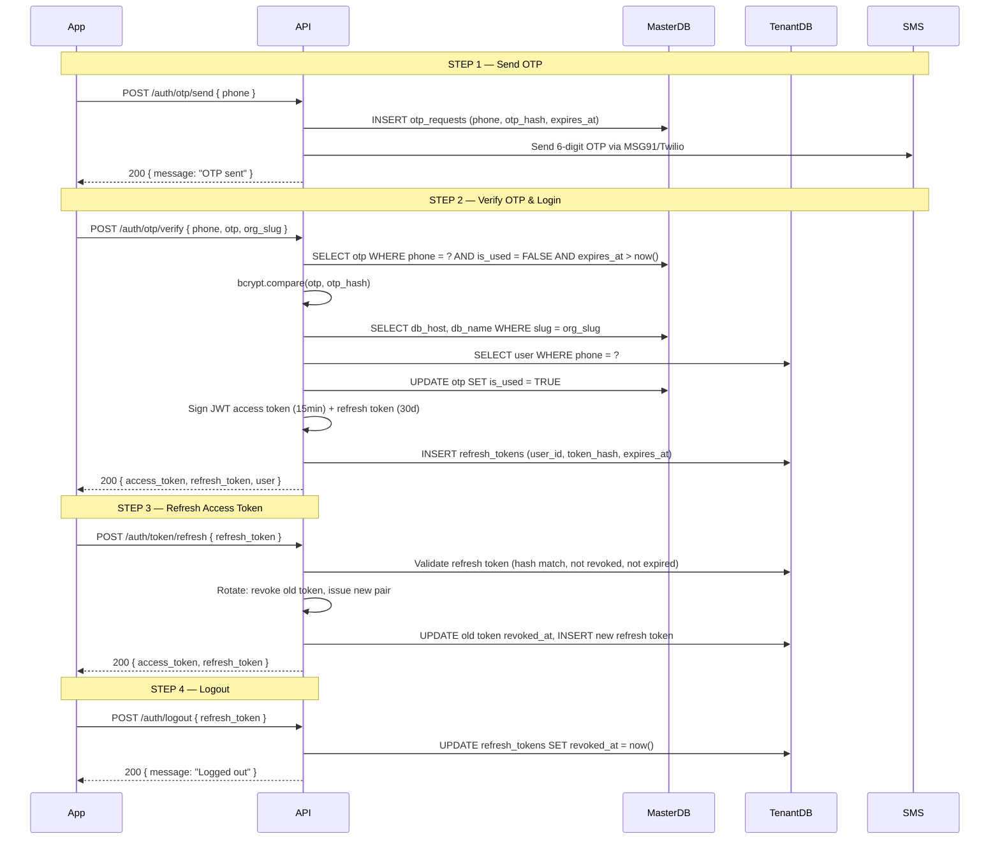

# API Structure, Auth Flow & ABAC Policies
**Project:** SC R&DT · POD Tracker
**Version:** 1.0 — Feb 2026

---

## 1. Auth Flow (OTP + JWT)



**JWT Payload structure:**
```jsonc
{
  "sub":      "user-uuid",
  "org_id":   "org-uuid",
  "role":     "transporter",          // transporter | trucker | driver
  "sub_role": "member",               // member | manager
  "iat":      1740000000,
  "exp":      1740000900              // +15 minutes
}
```

---

## 2. Middleware Execution Order

Every authenticated request passes through three middleware layers in order:

```
Request
  │
  ▼
① verifyJWT
  Extract JWT from Authorization: Bearer <token>
  Validate signature, expiry
  Attach { user_id, org_id, role, sub_role } to request context
  → 401 if invalid or expired
  │
  ▼
② resolveTenant
  Use org_id from JWT to look up DB connection (master DB or in-memory cache)
  Acquire pooled connection to tenant Postgres DB
  Attach db client to request context
  → 503 if tenant DB unreachable
  │
  ▼
③ authorize(action, resource)
  Call ABAC policy engine with { user, resource, action }
  Policy function returns true/false
  → 403 if denied
  │
  ▼
Controller → Service → Repository
```

**Public routes** (`/public/*`, `/auth/*`) skip middleware ① ② ③.

---

## 3. ABAC Policy Engine

Policies are pure functions. Each returns `boolean`. They are called by middleware ③.

```typescript
// policies/shipment.policy.ts

export const shipmentPolicies = {

  // View a shipment
  canView(user: JwtUser, shipment: Shipment): boolean {
    if (user.role === 'transporter') return user.org_id === shipment.org_id;
    if (user.role === 'trucker') {
      if (user.sub_role === 'manager') return user.org_id === shipment.org_id;
      return shipment.trucker_id === user.id;
    }
    if (user.role === 'driver') return shipment.driver_id === user.id;
    return false;
  },

  // Edit core fields (locked after Shared)
  canEditCore(user: JwtUser, shipment: Shipment): boolean {
    return user.role === 'transporter'
      && user.org_id === shipment.org_id
      && !shipment.core_fields_locked;
  },

  // Edit metadata (broker contact, notes — always editable by transporter)
  canEditMetadata(user: JwtUser, shipment: Shipment): boolean {
    return user.role === 'transporter' && user.org_id === shipment.org_id;
  },

  // Assign trucker
  canAssignTrucker(user: JwtUser, shipment: Shipment): boolean {
    return user.role === 'transporter'
      && user.org_id === shipment.org_id
      && !shipment.core_fields_locked;
  },

  // Assign driver + vehicle (trucker action)
  canAssignDriver(user: JwtUser, shipment: Shipment): boolean {
    return user.role === 'trucker'
      && shipment.trucker_id === user.id
      && !shipment.core_fields_locked;
  },

  // Generate share link
  canGenerateShareLink(user: JwtUser, shipment: Shipment): boolean {
    return user.role === 'transporter'
      && user.org_id === shipment.org_id
      && (shipment.status === 'pod_uploaded' || shipment.status === 'shared');
  },
};

// policies/document.policy.ts

export const documentPolicies = {

  // Upload a document — Q5 custom cascading rule
  canUpload(user: JwtUser, shipment: Shipment): boolean {
    if (user.role === 'driver') {
      return shipment.driver_id === user.id;
    }
    if (user.role === 'trucker') {
      return shipment.trucker_id === user.id
        && shipment.driver_id === null;
    }
    if (user.role === 'transporter') {
      return user.org_id === shipment.org_id
        && shipment.trucker_id === null
        && shipment.driver_id === null;
    }
    return false;
  },

  // Delete a document (only transporter, only if not locked)
  canDelete(user: JwtUser, shipment: Shipment): boolean {
    return user.role === 'transporter'
      && user.org_id === shipment.org_id
      && !shipment.core_fields_locked;
  },
};
```

---

## 4. Full API Endpoint Reference

### Base URL
```
https://api.podtracker.in/v1
```

### Auth Endpoints (no auth required)

| Method | Path | Description | Body |
|---|---|---|---|
| `POST` | `/auth/otp/send` | Send OTP to phone | `{ phone }` |
| `POST` | `/auth/otp/verify` | Verify OTP, issue tokens | `{ phone, otp, org_slug }` |
| `POST` | `/auth/token/refresh` | Rotate JWT pair | `{ refresh_token }` |
| `POST` | `/auth/logout` | Revoke refresh token | `{ refresh_token }` |

---

### Shipment Endpoints

**Auth required.** ABAC applied per action.

| Method | Path | Role(s) | ABAC Policy | Description |
|---|---|---|---|---|
| `GET` | `/shipments` | All | `canView` (filtered) | List shipments (role-filtered) |
| `POST` | `/shipments` | Transporter | org member | Create shipment |
| `GET` | `/shipments/:id` | All | `canView` | Get shipment detail |
| `PATCH` | `/shipments/:id/core` | Transporter | `canEditCore` | Edit core fields (locked at Shared) |
| `PATCH` | `/shipments/:id/metadata` | Transporter | `canEditMetadata` | Edit broker contact, notes |
| `POST` | `/shipments/:id/assign-trucker` | Transporter | `canAssignTrucker` | Assign or reassign trucker |
| `POST` | `/shipments/:id/assign-driver` | Trucker | `canAssignDriver` | Assign or reassign driver + vehicle |

**`GET /shipments` filtering by role:**
```
transporter   → WHERE org_id = user.org_id
trucker/member → WHERE trucker_id = user.id
trucker/manager → WHERE org_id = user.org_id
driver         → WHERE driver_id = user.id
```

---

### Document Endpoints

| Method | Path | Role(s) | ABAC Policy | Description |
|---|---|---|---|---|
| `GET` | `/shipments/:id/documents` | All | `canView(shipment)` | List documents for shipment |
| `POST` | `/shipments/:id/documents` | All | `canUpload` (Q5 rule) | Upload document (multipart) |
| `DELETE` | `/shipments/:id/documents/:docId` | Transporter | `canDelete` | Soft-delete document |
| `POST` | `/shipments/:id/documents/upload-url` | All | `canUpload` | **Future S3:** Get presigned upload URL |
| `POST` | `/shipments/:id/documents/confirm` | All | `canUpload` | **Future S3:** Confirm upload complete |

---

### Share Link Endpoints

| Method | Path | Role(s) | ABAC Policy | Description |
|---|---|---|---|---|
| `POST` | `/shipments/:id/share-links` | Transporter | `canGenerateShareLink` | Generate new share link |
| `GET` | `/shipments/:id/share-links` | Transporter | `canView(shipment)` | List all share links for shipment |
| `DELETE` | `/share-links/:linkId` | Transporter | org member + link owner | Revoke share link |

---

### Public Endpoints (no auth — broker access)

| Method | Path | Auth | Description |
|---|---|---|---|
| `GET` | `/public/s/:token` | None | Resolve share link, return shipment + docs |

---

### User & Org Management

| Method | Path | Role(s) | Description |
|---|---|---|---|
| `GET` | `/users/me` | All | Get current user profile |
| `PATCH` | `/users/me` | All | Update name |
| `POST` | `/users/invite` | Transporter | Invite trucker or driver to org |
| `GET` | `/users` | Transporter | List org members |
| `DELETE` | `/users/:id` | Transporter | Deactivate org member |

---

## 5. Request / Response Shapes

### POST `/auth/otp/send`
```jsonc
// Request
{ "phone": "+919876543210" }

// Response 200
{ "message": "OTP sent", "expires_in_seconds": 600 }

// Error 429 — too many OTP requests
{ "error": "RATE_LIMITED", "retry_after_seconds": 60 }
```

---

### POST `/auth/otp/verify`
```jsonc
// Request
{
  "phone":    "+919876543210",
  "otp":      "482910",
  "org_slug": "arjun-logistics"
}

// Response 200
{
  "access_token":  "eyJhbGci...",
  "refresh_token": "dGhpcyBpcyBh...",
  "expires_in":    900,
  "user": {
    "id":       "uuid",
    "name":     "Rajesh Pareek",
    "role":     "transporter",
    "sub_role": "member",
    "org_id":   "uuid"
  }
}

// Error 401 — wrong OTP
{ "error": "INVALID_OTP" }

// Error 410 — OTP expired
{ "error": "OTP_EXPIRED" }
```

---

### POST `/shipments` — Create Shipment
```jsonc
// Request
{
  "reference_number": "SHP-2025-00150",   // optional — system generates if omitted
  "shipper_name":     "Infosys Ltd."       // optional
}

// Response 201
{
  "id":               "uuid",
  "reference_number": "SHP-2025-00150",
  "status":           "created",
  "org_id":           "uuid",
  "created_at":       "2025-02-28T08:14:00Z"
}

// Error 409 — duplicate reference number in org
{ "error": "DUPLICATE_REFERENCE_NUMBER" }
```

---

### POST `/shipments/:id/assign-trucker`
```jsonc
// Request
{
  "trucker_id": "uuid",
  "reason":     "original trucker unavailable"  // optional — stored in event payload
}

// Response 200
{
  "shipment_id": "uuid",
  "trucker_id":  "uuid",
  "status":      "assigned",
  "event_id":    "uuid"   // ID of the appended event log entry
}

// Error 403 — transporter doesn't own this shipment
{ "error": "FORBIDDEN" }

// Error 409 — shipment is locked (already shared)
{ "error": "SHIPMENT_LOCKED", "message": "Core fields cannot be edited after Shared status." }
```

---

### POST `/shipments/:id/documents` — Upload Document
```
Content-Type: multipart/form-data

Fields:
  file      (binary)  required
  doc_type  (string)  required  — pod | weighbridge | invoice | eway_bill | custom
```

```jsonc
// Response 201
{
  "id":                "uuid",
  "shipment_id":       "uuid",
  "doc_type":          "pod",
  "original_filename": "delivery_receipt.jpg",
  "file_size_bytes":   1243000,
  "mime_type":         "image/jpeg",
  "uploader_role":     "driver",
  "created_at":        "2025-02-28T09:30:00Z"
}

// Error 403 — upload not permitted (ABAC Q5 rule)
{
  "error": "UPLOAD_NOT_PERMITTED",
  "message": "Driver is already assigned. Only the driver may upload documents."
}

// Error 413 — file too large
{ "error": "FILE_TOO_LARGE", "max_size_mb": 5 }

// Error 415 — unsupported MIME type
{ "error": "UNSUPPORTED_FILE_TYPE", "allowed": ["image/jpeg","image/png","image/webp","application/pdf"] }
```

---

### POST `/shipments/:id/share-links` — Generate Share Link
```jsonc
// Request
{
  "visible_doc_types": ["pod", "eway_bill"],  // transporter selects which docs to expose
  "expires_in_days":   30                     // optional, default 30
}

// Response 201
{
  "id":                "uuid",
  "token":             "xK9bP2m4Qr",
  "url":               "https://pod.podtracker.in/s/xK9bP2m4Qr",
  "whatsapp_deeplink": "whatsapp://send?text=View+POD+at+https://pod.podtracker.in/s/xK9bP2m4Qr",
  "expires_at":        "2025-03-30T08:14:00Z",
  "visible_doc_types": ["pod", "eway_bill"]
}
```

---

### GET `/public/s/:token` — Broker View (no auth)
```jsonc
// Response 200
{
  "shipment": {
    "reference_number": "SHP-2025-00142",
    "shipper_name":     "Infosys Ltd.",
    "driver":           "Ramesh Kumar",
    "vehicle_number":   "MH 04 GH 7821",
    "status":           "shared"
  },
  "documents": [
    {
      "id":              "uuid",
      "doc_type":        "pod",
      "view_url":        "https://api.podtracker.in/files/org1/ship1/doc1.jpg?sig=...",
      "original_filename": "delivery_receipt.jpg",
      "uploaded_at":     "2025-02-21T08:14:00Z"
    }
  ],
  "link": {
    "expires_at":   "2025-03-30T08:14:00Z",
    "generated_by": "Transporter"
  }
}

// Error 404 — token not found
{ "error": "LINK_NOT_FOUND" }

// Error 410 — link expired
{ "error": "LINK_EXPIRED" }

// Error 410 — link revoked
{ "error": "LINK_REVOKED" }
```

---

## 6. API Error Response Standard

All errors follow this envelope:

```jsonc
{
  "error":   "ERROR_CODE",          // machine-readable constant
  "message": "Human readable text", // optional, for debugging
  "field":   "reference_number"     // optional, for validation errors
}
```

| HTTP Code | When |
|---|---|
| `400` | Validation error (missing fields, wrong format) |
| `401` | Missing or invalid JWT |
| `403` | ABAC policy denied |
| `404` | Resource not found |
| `409` | Conflict (duplicate ref number, shipment locked) |
| `410` | Share link expired or revoked |
| `413` | File too large |
| `415` | Unsupported file type |
| `429` | Rate limited (OTP, upload) |
| `500` | Unexpected server error |
| `503` | Tenant DB unreachable |

---

## 7. Rate Limits

| Endpoint | Limit | Window |
|---|---|---|
| `POST /auth/otp/send` | 3 requests | per phone per 60s |
| `POST /auth/otp/verify` | 5 attempts | per OTP before lockout |
| `POST /shipments/:id/documents` | 20 uploads | per user per minute |
| `GET /public/s/:token` | 100 requests | per IP per minute |

---

## 8. File Serving (Signed URLs)

Documents are never served directly from `/shipments/:id/documents/:docId`.
The URL returned in API responses is a **time-limited signed URL**:

```
GET /files/{org_id}/{shipment_id}/{document_id}.jpg?sig={hmac_signature}&exp={unix_ts}
```

- Signature: `HMAC-SHA256(path + expiry, FILE_SIGNING_SECRET)`
- Expiry: 1 hour for authenticated users, 30 min for broker public view
- For future S3: replace with native S3 presigned URL — same interface, zero API changes

---

*Prepared by: Oz — Senior Solution Architect*
*Project: SC R&DT · POD Tracker · Feb 2026*
