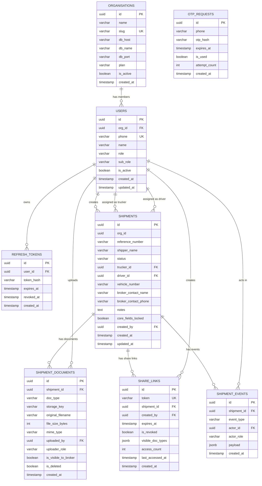

# Database Schema & ER Diagram
**Project:** SC R&DT · POD Tracker
**Version:** 1.0 — Feb 2026

---

## Database Topology

```
┌─────────────────────────────────────────────────────────┐
│  MASTER REGISTRY DB (shared, single instance)           │
│  Tables: organisations, otp_requests                    │
│  Purpose: Tenant routing + pre-auth OTP storage         │
└─────────────────────────────────────────────────────────┘

┌──────────────────┐  ┌──────────────────┐  ┌──────────────────┐
│  ORG 1 DB        │  │  ORG 2 DB        │  │  ORG N DB        │
│  (isolated)      │  │  (isolated)      │  │  (isolated)      │
│  users           │  │  users           │  │  users           │
│  shipments       │  │  shipments       │  │  shipments       │
│  shipment_docs   │  │  shipment_docs   │  │  shipment_docs   │
│  share_links     │  │  share_links     │  │  share_links     │
│  shipment_events │  │  shipment_events │  │  shipment_events │
│  refresh_tokens  │  │  refresh_tokens  │  │  refresh_tokens  │
└──────────────────┘  └──────────────────┘  └──────────────────┘
```

---

## 1. ER Diagram



> **Note:** `ORGANISATIONS` and `OTP_REQUESTS` live in the **Master Registry DB**.
> All other tables live in each **Tenant (Org) DB** in isolation.

---

## 2. Table Definitions

### Master Registry DB

#### `organisations`
```sql
CREATE TABLE organisations (
    id          UUID PRIMARY KEY DEFAULT gen_random_uuid(),
    name        VARCHAR(200) NOT NULL,
    slug        VARCHAR(60)  NOT NULL UNIQUE,   -- e.g. "arjun-logistics"
    db_host     VARCHAR(255) NOT NULL,
    db_port     INTEGER      NOT NULL DEFAULT 5432,
    db_name     VARCHAR(100) NOT NULL,
    plan        VARCHAR(20)  NOT NULL DEFAULT 'mvp'
                CHECK (plan IN ('mvp', 'growth', 'enterprise')),
    is_active   BOOLEAN      NOT NULL DEFAULT TRUE,
    created_at  TIMESTAMPTZ  NOT NULL DEFAULT now()
);
```

#### `otp_requests`
```sql
-- Stored in master DB so OTP works before tenant is resolved
CREATE TABLE otp_requests (
    id            UUID PRIMARY KEY DEFAULT gen_random_uuid(),
    phone         VARCHAR(15) NOT NULL,
    otp_hash      VARCHAR(255) NOT NULL,      -- bcrypt hash of 6-digit OTP
    expires_at    TIMESTAMPTZ  NOT NULL,       -- now() + 10 minutes
    is_used       BOOLEAN      NOT NULL DEFAULT FALSE,
    attempt_count INTEGER      NOT NULL DEFAULT 0,
    created_at    TIMESTAMPTZ  NOT NULL DEFAULT now()
);

CREATE INDEX idx_otp_phone ON otp_requests (phone, is_used, expires_at);
```

---

### Tenant DB (per Organisation)

#### `users`
```sql
CREATE TYPE user_role    AS ENUM ('transporter', 'trucker', 'driver');
CREATE TYPE user_subrole AS ENUM ('member', 'manager');

CREATE TABLE users (
    id          UUID         PRIMARY KEY DEFAULT gen_random_uuid(),
    org_id      UUID         NOT NULL,         -- denormalised for query convenience
    phone       VARCHAR(15)  NOT NULL UNIQUE,
    name        VARCHAR(200) NOT NULL,
    role        user_role    NOT NULL,
    sub_role    user_subrole NOT NULL DEFAULT 'member',
    is_active   BOOLEAN      NOT NULL DEFAULT TRUE,
    created_at  TIMESTAMPTZ  NOT NULL DEFAULT now(),
    updated_at  TIMESTAMPTZ  NOT NULL DEFAULT now()
);

CREATE INDEX idx_users_phone ON users (phone);
```

> `sub_role = 'manager'` is only meaningful when `role = 'trucker'`.
> Used to unlock org-wide shipment visibility (Q6: C).

---

#### `refresh_tokens`
```sql
CREATE TABLE refresh_tokens (
    id          UUID         PRIMARY KEY DEFAULT gen_random_uuid(),
    user_id     UUID         NOT NULL REFERENCES users(id) ON DELETE CASCADE,
    token_hash  VARCHAR(255) NOT NULL,         -- SHA-256 hash of refresh token
    expires_at  TIMESTAMPTZ  NOT NULL,
    revoked_at  TIMESTAMPTZ,                   -- NULL = active
    created_at  TIMESTAMPTZ  NOT NULL DEFAULT now()
);

CREATE INDEX idx_rt_user ON refresh_tokens (user_id, revoked_at);
```

---

#### `shipments`
```sql
CREATE TYPE shipment_status AS ENUM ('created', 'assigned', 'pod_uploaded', 'shared');

CREATE TABLE shipments (
    id                    UUID            PRIMARY KEY DEFAULT gen_random_uuid(),
    org_id                UUID            NOT NULL,
    reference_number      VARCHAR(100)    NOT NULL,    -- user-defined or system fallback
    shipper_name          VARCHAR(200),
    status                shipment_status NOT NULL DEFAULT 'created',
    trucker_id            UUID            REFERENCES users(id),
    driver_id             UUID            REFERENCES users(id),
    vehicle_number        VARCHAR(50),
    broker_contact_name   VARCHAR(200),               -- metadata: always editable
    broker_contact_phone  VARCHAR(15),                -- metadata: always editable
    notes                 TEXT,                       -- metadata: always editable
    core_fields_locked    BOOLEAN         NOT NULL DEFAULT FALSE,
                                                      -- set TRUE when status = 'shared'
    created_by            UUID            NOT NULL REFERENCES users(id),
    created_at            TIMESTAMPTZ     NOT NULL DEFAULT now(),
    updated_at            TIMESTAMPTZ     NOT NULL DEFAULT now(),

    CONSTRAINT uq_shipment_ref_per_org UNIQUE (org_id, reference_number)
);

CREATE INDEX idx_shipments_org      ON shipments (org_id, status);
CREATE INDEX idx_shipments_trucker  ON shipments (trucker_id);
CREATE INDEX idx_shipments_driver   ON shipments (driver_id);
```

**Field-level lock rules (Q2: C):**
| Field | Locked at `Shared`? |
|---|---|
| `reference_number` | ✅ Yes — core |
| `shipper_name` | ✅ Yes — core |
| `status` | ✅ Yes — core (state machine only) |
| `trucker_id` | ✅ Yes — core |
| `driver_id` | ✅ Yes — core |
| `vehicle_number` | ✅ Yes — core |
| `broker_contact_name` | ❌ No — metadata |
| `broker_contact_phone` | ❌ No — metadata |
| `notes` | ❌ No — metadata |

---

#### `shipment_documents`
```sql
CREATE TYPE doc_type      AS ENUM ('pod', 'weighbridge', 'invoice', 'eway_bill', 'custom');
CREATE TYPE uploader_role AS ENUM ('transporter', 'trucker', 'driver');

CREATE TABLE shipment_documents (
    id                  UUID          PRIMARY KEY DEFAULT gen_random_uuid(),
    shipment_id         UUID          NOT NULL REFERENCES shipments(id) ON DELETE CASCADE,
    doc_type            doc_type      NOT NULL,
    storage_key         VARCHAR(500)  NOT NULL,    -- local path OR S3 object key
    original_filename   VARCHAR(255)  NOT NULL,
    file_size_bytes     INTEGER       NOT NULL,
    mime_type           VARCHAR(100)  NOT NULL
                        CHECK (mime_type IN ('image/jpeg','image/png','image/webp','application/pdf')),
    uploaded_by         UUID          NOT NULL REFERENCES users(id),
    uploader_role       uploader_role NOT NULL,
    is_visible_to_broker BOOLEAN      NOT NULL DEFAULT FALSE,
                                                   -- set when transporter configures share link (Q4)
    is_deleted          BOOLEAN       NOT NULL DEFAULT FALSE,
    created_at          TIMESTAMPTZ   NOT NULL DEFAULT now()
);

CREATE INDEX idx_docs_shipment ON shipment_documents (shipment_id, is_deleted);
```

---

#### `share_links`
```sql
CREATE TABLE share_links (
    id                UUID         PRIMARY KEY DEFAULT gen_random_uuid(),
    token             VARCHAR(12)  NOT NULL UNIQUE,   -- base62 slug, e.g. 'xK9bP2m4Qr'
    shipment_id       UUID         NOT NULL REFERENCES shipments(id),
    created_by        UUID         NOT NULL REFERENCES users(id),
    expires_at        TIMESTAMPTZ  NOT NULL,           -- default: now() + 30 days
    is_revoked        BOOLEAN      NOT NULL DEFAULT FALSE,
    visible_doc_types JSONB        NOT NULL DEFAULT '[]'::jsonb,
                                                       -- e.g. ["pod", "eway_bill"]
    access_count      INTEGER      NOT NULL DEFAULT 0,
    last_accessed_at  TIMESTAMPTZ,
    created_at        TIMESTAMPTZ  NOT NULL DEFAULT now()
);

CREATE UNIQUE INDEX idx_sharelink_token     ON share_links (token);
CREATE INDEX        idx_sharelink_shipment  ON share_links (shipment_id, is_revoked);
```

---

#### `shipment_events`
```sql
CREATE TYPE event_type AS ENUM (
    'shipment_created',
    'trucker_assigned',
    'trucker_reassigned',
    'driver_assigned',
    'driver_reassigned',
    'document_uploaded',
    'document_deleted',
    'share_link_generated',
    'share_link_revoked',
    'status_changed',
    'broker_contact_added',
    'broker_contact_updated',
    'notes_updated',
    'core_fields_locked'
);

CREATE TYPE actor_role AS ENUM ('transporter', 'trucker', 'driver', 'system');

CREATE TABLE shipment_events (
    id           UUID        PRIMARY KEY DEFAULT gen_random_uuid(),
    shipment_id  UUID        NOT NULL REFERENCES shipments(id),
    event_type   event_type  NOT NULL,
    actor_id     UUID        REFERENCES users(id),   -- NULL for system events
    actor_role   actor_role  NOT NULL,
    payload      JSONB       NOT NULL DEFAULT '{}'::jsonb,
                                                      -- { old_value, new_value, metadata }
    created_at   TIMESTAMPTZ NOT NULL DEFAULT now()
);

-- Events are NEVER updated or deleted. Append-only.
CREATE INDEX idx_events_shipment ON shipment_events (shipment_id, created_at);
CREATE INDEX idx_events_actor    ON shipment_events (actor_id, created_at);
```

**Event payload examples:**
```jsonc
// trucker_reassigned
{
  "old_trucker_id": "uuid-old",
  "old_trucker_name": "Bharat Logistics",
  "new_trucker_id": "uuid-new",
  "new_trucker_name": "Arjun Transport Co.",
  "reason": "capacity issue"
}

// document_uploaded
{
  "document_id": "uuid-doc",
  "doc_type": "pod",
  "original_filename": "delivery_receipt.jpg",
  "file_size_bytes": 1243000
}

// share_link_generated
{
  "share_link_id": "uuid-link",
  "token": "xK9bP2m4Qr",
  "expires_at": "2025-03-23T08:14:00Z",
  "visible_doc_types": ["pod"]
}

// status_changed
{
  "old_status": "pod_uploaded",
  "new_status": "shared"
}
```

---

## 3. Shipment Reference Number Generation (Q7: C)

```
User-defined → validate unique within org → INSERT
                      ↓ duplicate?
              System fallback: SHP-{YYYY}-{seq_per_org:05d}
              e.g. SHP-2025-00143
```

The sequence counter is maintained per org. Implementation:
```sql
-- Per-org sequence tracking (optional, simpler alternative to Postgres SEQUENCE)
CREATE TABLE shipment_ref_sequences (
    org_id      UUID    PRIMARY KEY,
    last_seq    INTEGER NOT NULL DEFAULT 0
);
-- Increment atomically: UPDATE ... SET last_seq = last_seq + 1 RETURNING last_seq
```

---

## 4. Document Attachment Permission Matrix (Q5 Custom Rule)

| Who uploads | Condition required | Allowed `doc_type` |
|---|---|---|
| `driver` | `shipment.driver_id === user.id` | `pod`, `weighbridge`, `custom` |
| `trucker` | `shipment.trucker_id === user.id` AND `shipment.driver_id IS NULL` | `pod`, `weighbridge`, `custom` |
| `transporter` | `shipment.org_id === user.org_id` AND `trucker_id IS NULL` AND `driver_id IS NULL` | All types |

> Rule: document upload responsibility cascades down the assignment chain.
> Once a downstream actor is assigned, the upstream actor loses upload rights.
> Broker can **never** upload — anonymous read-only access only.

---

## 5. Indexes & Constraints Summary

| Table | Index | Purpose |
|---|---|---|
| `otp_requests` | `(phone, is_used, expires_at)` | Fast OTP lookup on login |
| `shipments` | `(org_id, status)` | Dashboard list filtered by org + status |
| `shipments` | `(trucker_id)` | Trucker's assigned shipments |
| `shipments` | `(driver_id)` | Driver's assigned shipments |
| `shipments` | `UNIQUE (org_id, reference_number)` | Prevent duplicate ref numbers per org |
| `shipment_documents` | `(shipment_id, is_deleted)` | Fetch active docs for a shipment |
| `share_links` | `UNIQUE (token)` | O(1) token resolution for public link |
| `share_links` | `(shipment_id, is_revoked)` | List active links per shipment |
| `shipment_events` | `(shipment_id, created_at)` | Chronological audit trail per shipment |
| `refresh_tokens` | `(user_id, revoked_at)` | Find active refresh token for user |

---

## 6. Migration Strategy (DB-per-tenant)

```bash
# Run migrations across all tenant DBs
# Script iterates organisations table in master DB

SELECT id, db_host, db_port, db_name FROM organisations WHERE is_active = TRUE;

# For each org → connect → run Prisma migrate deploy
npx prisma migrate deploy --schema=./prisma/tenant.schema.prisma
```

> Keep tenant schema in `prisma/tenant.schema.prisma`.
> Keep master schema in `prisma/master.schema.prisma`.
> CI pipeline runs master migrations first, then all tenant migrations.

---

*Prepared by: Oz — Senior Solution Architect*
*Project: SC R&DT · POD Tracker · Feb 2026*
