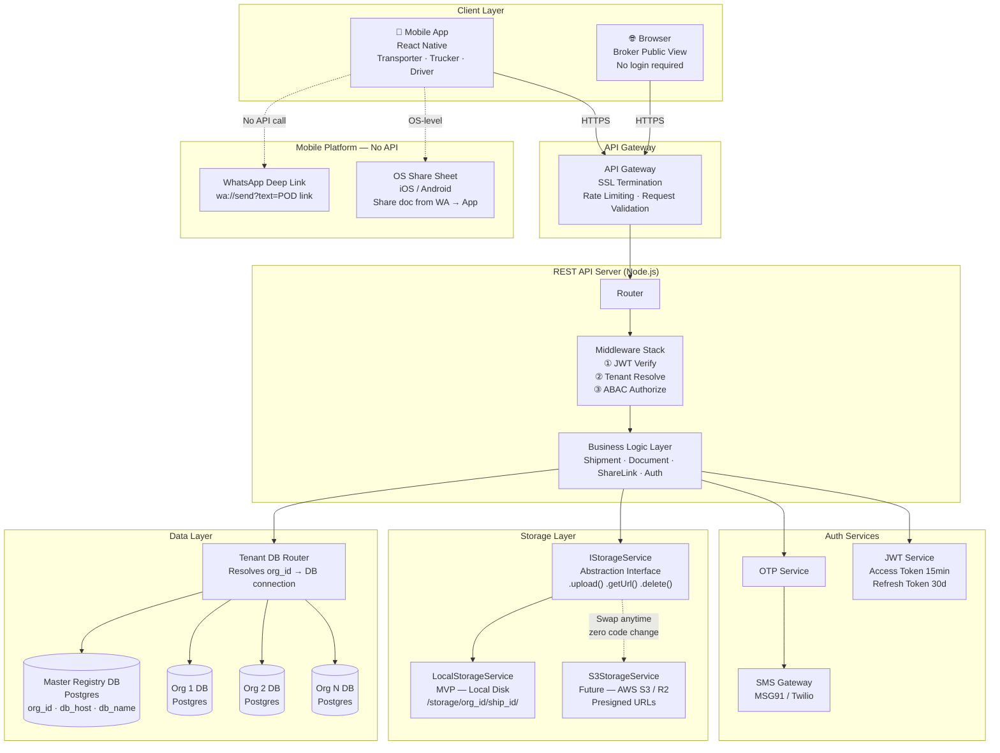
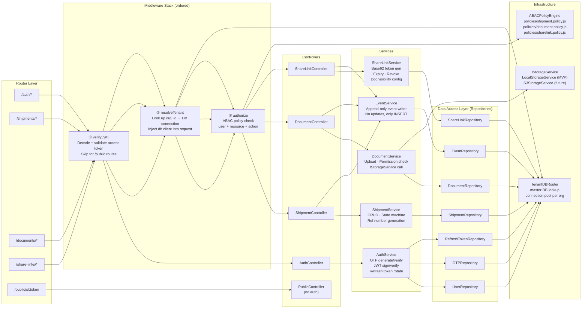
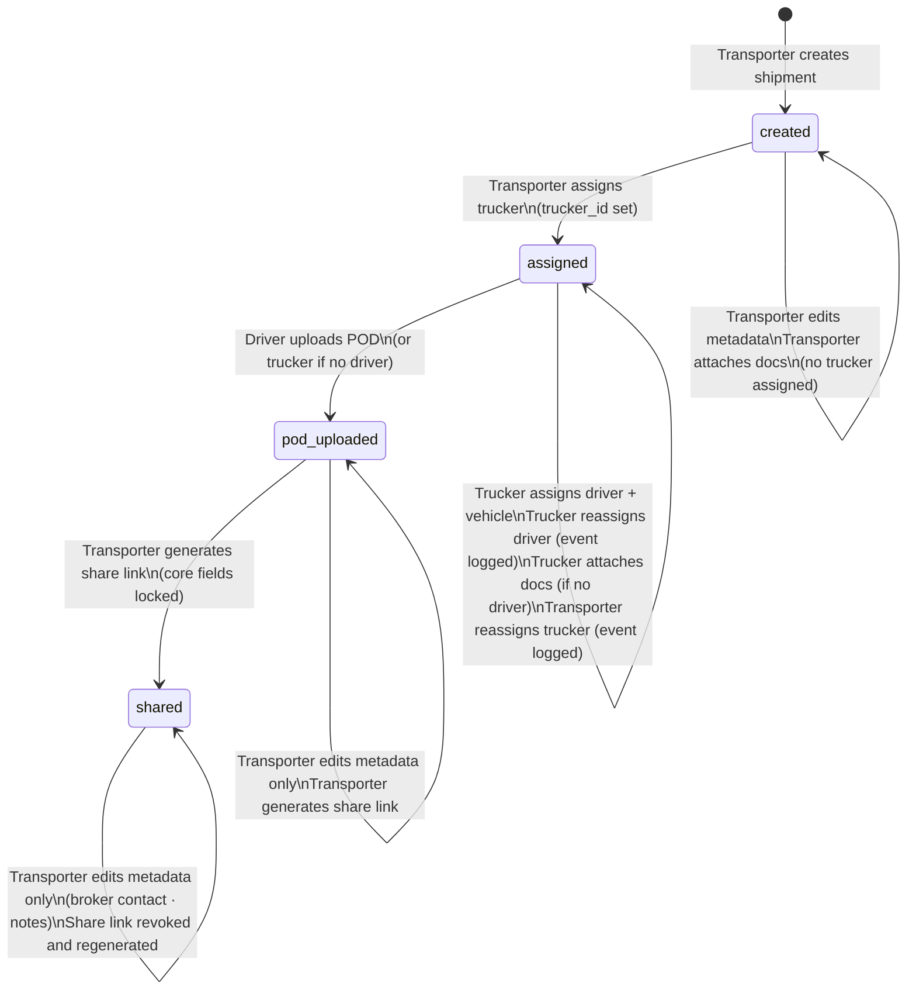
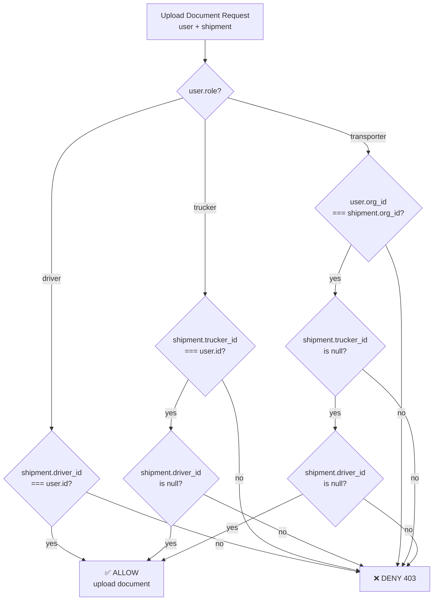
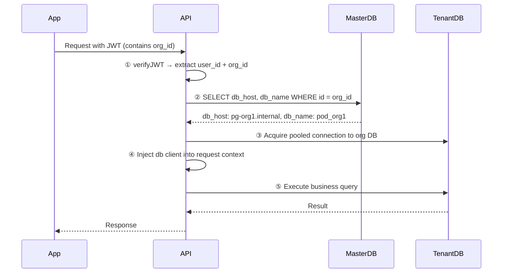
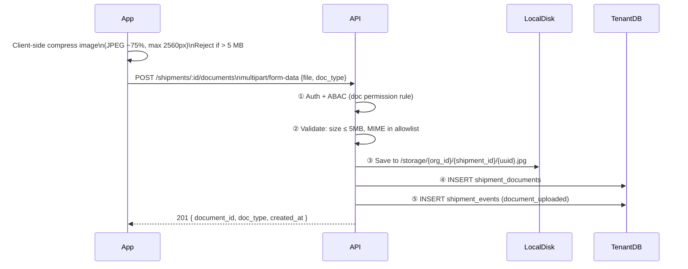
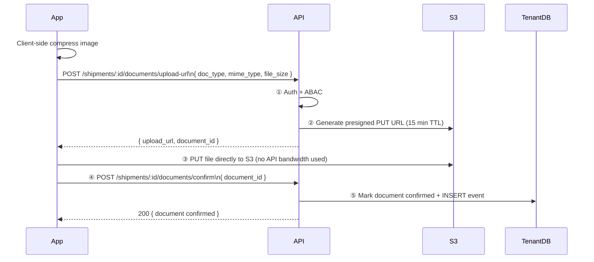

# High-Level Architecture
**Project:** SC R&DT · POD Tracker
**Version:** 1.0 — Based on finalized decisions (Feb 2026)

---

## Finalized Decision Summary

| # | Decision | Chosen |
|---|---|---|
| Q1 | Assignment changes | **C — Event log** (immutable, append-only) |
| Q2 | Shipment lock | **C — Field-level** (core locks at `Shared`, metadata always editable) |
| Q3 | Documents | **B — Multiple docs with types** (`doc_type` enum) |
| Q4 | Broker scope | **B — Configurable per link** (transporter selects visible docs) |
| Q5 | Attachment permissions | **Custom rule** — cascades by assignment state (see ABAC) |
| Q6 | Trucker visibility | **C — Manager override** (`trucker` + `trucker_manager` sub-role) |
| Q7 | Shipment number | **C — User-defined with fallback**, unique per org |
| Q8 | Org model | **B — Org + Users** |
| Q9 | Broker | **A — Anonymous external** (no login required) |
| Q10 | Share links | **B — Separate `share_links` table** (+ Redis caching later) |
| Q11 | Audit log | **B — Append-only `shipment_events` table** |
| Q12 | Storage | **B — Local disk, MVP** via `IStorageService` interface (S3-switchable) |
| Q13 | Compression | **B — Client-side** (API hard-rejects if over size limit) |
| Q14 | Schema readiness | **Future-ready now** (`shipment_documents` table from day one) |
| Q15 | Auth | **C — Phone OTP + JWT** (access 15m + refresh 30d) |
| Q16 | Token entropy | **B — Base62 slug** (10 chars, e.g. `xK9bP2m4`) |
| Q17 | Access control | **C — ABAC** (attribute-based policy engine) |
| Q18 | Volume | **MVP scale** → horizontal scaling path defined |
| Q19 | Multi-tenancy | **C — DB-per-tenant** (master registry + per-org Postgres) |
| Q20 | Concurrent uploads | **100–1,000** → presigned URL upload flow (ready for S3 switch) |
| Q21 | WhatsApp | **Deeplink only** — `wa://send?text=<link>`, zero API integration |
| Q22 | AI | **Deferred** — design leaves async worker hook in Document Service |
| Q23 | Events | **Direct function calls** (MVP) |

> **⚠ Architecture Note — Q19 vs Q18:**
> DB-per-tenant (Q19: C) at MVP scale (Q18) adds operational overhead —
> each new org requires a provisioned Postgres instance and migrations must run per-tenant.
> Mitigate by using a migration runner that iterates all registered tenant DBs.
> This choice provides maximum data isolation and is correct long-term. Accept the MVP overhead.

---

## 1. High-Level Architecture Diagram

---

## 2. Component Diagram — API Server Internals

---

## 3. Shipment State Machine

---

## 4. Document Attachment Permission Flow (Q5 Custom Rule)

> **Mobile-only feature (no API change needed):**
> Transporter can share a document from WhatsApp to the app via the OS Share Sheet.
> The app registers as a share target on iOS / Android.
> The OS passes the file to the app → app shows a shipment picker → calls the document upload API.
> This is entirely a mobile app concern.

---

## 5. Tenant DB Resolution Flow

> Connection pools are maintained per tenant. On MVP, use a simple pool map:
> `Map<org_id, PgPool>`. On scale, use PgBouncer per tenant or a connection proxy.

---

## 6. Document Upload Flow — MVP vs Future

### MVP (Local Storage)

### Future (S3 Presigned URL — same IStorageService interface)

---

## 7. Tech Stack Recommendation

| Layer | MVP Choice | Rationale |
|---|---|---|
| **API Framework** | Node.js + Fastify | Fast, schema validation built-in, TypeScript-friendly |
| **Language** | TypeScript | Type safety for ABAC policies + DB models |
| **ORM / Query Builder** | Prisma (per-tenant) | Schema-per-DB support, migration runner scriptable |
| **Master DB** | PostgreSQL | Same stack as tenant DBs |
| **Tenant DBs** | PostgreSQL | Reliable, JSON support for event payloads |
| **Auth OTP** | MSG91 / Twilio Verify | Indian market (MSG91), global fallback (Twilio) |
| **Storage (MVP)** | Local disk | Simple; abstracted behind IStorageService |
| **Storage (Future)** | Cloudflare R2 | S3-compatible, no egress fees, India CDN |
| **Mobile App** | React Native | One codebase, iOS + Android |
| **Hosting (MVP)** | Single VPS (DigitalOcean / Railway) | Low cost, easy deploy |
| **Hosting (Scale)** | Multiple VPS + Nginx LB | Horizontal scale path |

---

*Prepared by: Oz — Senior Solution Architect*
*Project: SC R&DT · POD Tracker · Feb 2026*
